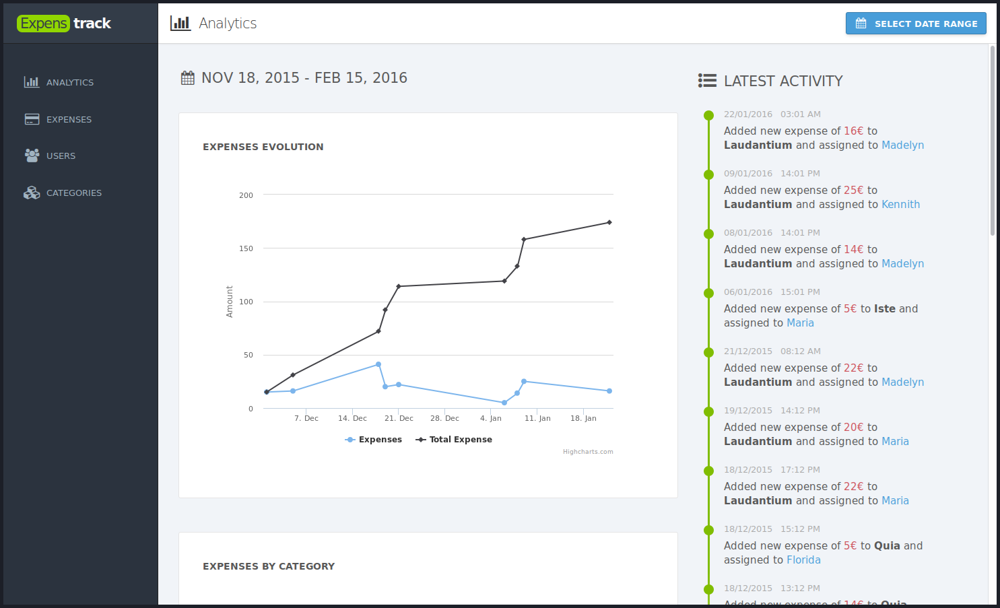

# ExpensTrack

ExpensTrack is a webapp to manage expenses. It represents my journey through react, redux and modern JavaScript tooling. It's a frontend for [expenses-api](https://github.com/larsbs/expenses-api/). Take it as a real-real-world example for [redux](https://github.com/reactjs/redux)




## Installation

You can download the code and play with it if you want.

```bash
$ git clone https://github.com/larsbs/expenses-api-frontend.git expenstrack
$ cd expenstrack
$ npm install
$ npm start
```

The application will expect that you have [expenses-api](http://github.com/larsbs/expenses-api) running on [http://localhost:4000/](http://localhost:4000/).


## Technologies

The technologies used so far are:

 * React
 * Redux
 * Redux-Sagas
 * Webpack
 * React-Redux-Router
 * Babel

And many more...


## Tests

> Testing is incomplete yet.

You can test the code with the following command:

```bash
$ npm test
```

After the command finishes, open a browser and go to [http://localhost:8081/test](http://localhost:8081/test).


## License

[MIT](LICENSE)
